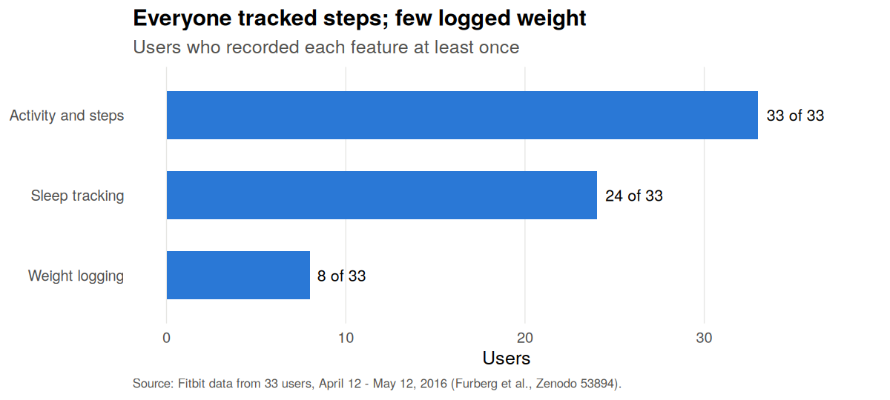
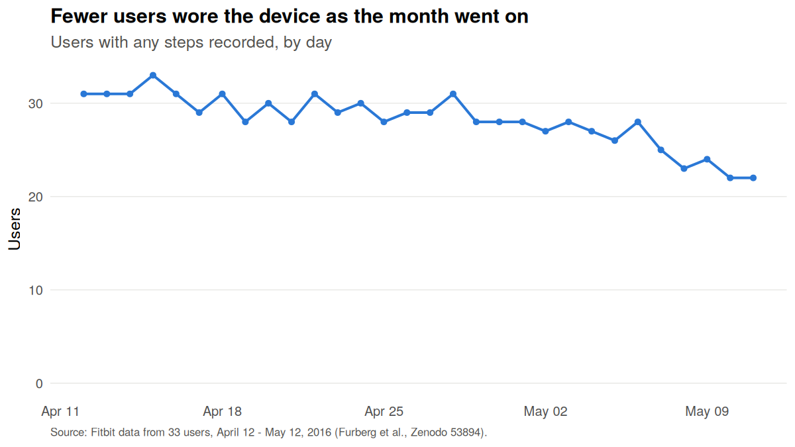
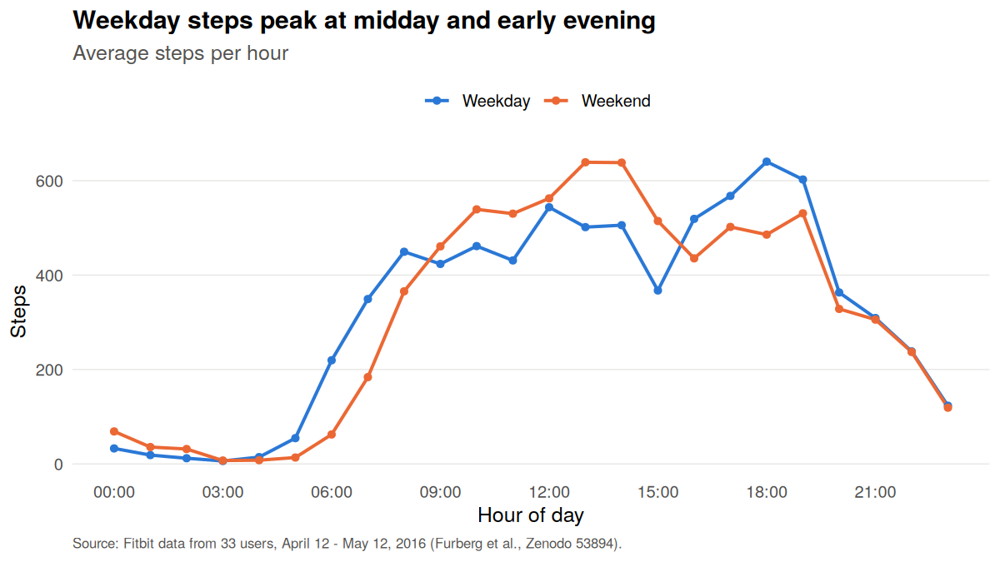
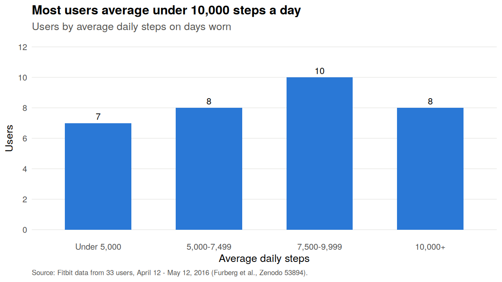

# Bellabeat Smart Device Analysis

Google Data Analytics Certificate capstone case study. The question: how do people use non-Bellabeat smart devices, and what does that suggest for Bellabeat's marketing?

Every number and chart below is produced by [`analysis/bellabeat_analysis.R`](analysis/bellabeat_analysis.R).

## Data

[Crowd-sourced Fitbit datasets 03.12.2016–05.12.2016](https://zenodo.org/records/53894) (Furberg, Brinton, Keating and Ortiz; CC BY 4.0). This analysis uses the April 12 – May 12, 2016 export: daily activity for 33 users, sleep records for 24, weight logs for 8, and hourly steps. May 12 is only partly recorded, so wear figures use the 30 full days.

## Key findings

**Wear drops off.** 31 users wore the device on day 1; 22 did on the last full day. Users averaged 25.6 days of wear out of 30, and 18 of 33 wore it every day. Only 48% of worn days were full 24-hour wear.

**Steps are tracked; weight mostly isn't.** All 33 users recorded steps and 24 recorded sleep, but only 8 logged weight. Two of them made 54 of the 67 weight entries.

| Activity (days worn) | Value |
|---|---:|
| Mean daily steps | 8,319 |
| Median daily steps | 8,053 |
| Days with 10,000+ steps | 35% |
| Days with 7,500+ steps | 54% |
| Very or fairly active minutes per day | 37.8 |
| Hours logged as sedentary per day (can include sleep) | 15.9 |
| Correlation, daily steps vs calories | 0.59 |

**Activity is steady across the week.** Weekday and weekend averages are almost identical (8,328 vs 8,295 steps). Weekday steps peak at 6 PM, with a smaller lunchtime peak; weekend steps peak at 1–2 PM.

**Most users are below 10,000 steps.** On average daily steps, 7 users are under 5,000, 8 are at 5,000–7,499, 10 are at 7,500–9,999 and 8 reach 10,000 or more.

**Sleep runs short.** Across 410 nights from 24 users, the average was 7.0 hours asleep, 44% of nights were under 7 hours, and users spent an average of 39 minutes in bed awake.






## Recommendations for Bellabeat

1. **Sell wearability.** Daily wearers fell by nearly 30% over a month and half of worn days were partial. Market Bellabeat's jewelry-style trackers on comfort and all-day wear, and use app reminders when a device goes unworn.
2. **Automate, don't ask.** Manual logging barely happens (8 of 33 logged weight). Lead with what's captured automatically, such as steps, sleep and activity, and connect weight to smart scales rather than manual entry.
3. **Coach sleep.** 44% of recorded nights were under 7 hours. Sleep insights and wind-down reminders speak to a real gap.
4. **Time nudges to the day.** Send movement prompts before the 6 PM weekday peak and around midday on weekends, aimed at the 15 users averaging under 7,500 steps.

## Limits

- 33 users over one month in 2016, recruited through Amazon Mechanical Turk; not a representative sample.
- Fitbit users, not Bellabeat customers; no age or gender data, although Bellabeat's market is women.
- Sedentary minutes can include sleep for users who don't track sleep.

## Run it

Requires R with `dplyr` and `ggplot2`. From the repository root:

```r
source("analysis/bellabeat_analysis.R")
```

The script downloads the Zenodo export into `data/` if it's missing, then writes tables to `outputs/` and charts to `outputs/charts/`.

## Contact

**Chinua Eric Robinson** · [chinuaericrobinson@chinuaericrobinson.com](mailto:chinuaericrobinson@chinuaericrobinson.com) · [LinkedIn](https://www.linkedin.com/in/chinua-eric-robinson) · [chinuaericrobinson.com](https://www.chinuaericrobinson.com)
